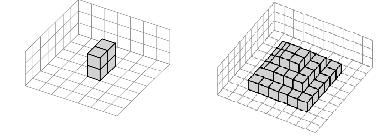

Create an instance generator
=====================================================================================

Imagine that we want to create new instances for a given problem, a typical approach would be to:

    (1) write a generator program that receives some parameters and outputs a number of random solutions according to the values of those parameters. For example, to create new instances for the bin packing problem, we can write a generator that receives as input the number of items, the range of bin's capacity, the ratio of items with certain ranges of sizes (small/medium/large), etc, and make sure that the generator will output instances that satisfy those inputs. 
    (2) fine tune the parameters of the generator if we want to tailor the generation towards instances with certain properties that we are interested in, such as instances that are non-trivial to solve by a particular solver.

AutoIG takes an alternative approach to (1) and let users describe the instance generator *declaratively* as a constraint model, leaving the task of creating the instances themselves to a constraint solver. More specificially, given a parameter setting of the generator model, i.e., a *generator instance*, new instances are generated via solving the generator model using the constraint solver `minion`_. An additional advantage of this approach is that in certain scenarios, users may only be interested in some particular types instances with certain structures. Such information can be injected into the generator model as constraints (we call them **validity constraints**), and AutoIG will only accept instances that satisfy such constraints.

.. _`minion`: https://constraintmodelling.org/minion/

We provide a number of `example generator models`_ (written in Essence_) for five problems taken from the `MiniZinc competitions`_. More details about those generators can be found in our `paper`_ (section 4).

.. _`example generator models`: https://github.com/stacs-cp/AutoIG/tree/main/data/models
.. _Essence: https://conjure.readthedocs.io/en/latest/essence.html
.. _`MiniZinc competitions`: https://www.minizinc.org/challenge.html
.. _`paper`: https://arxiv.org/abs/2205.14753

**A generator model include three parts:**

    - *Generator parameters*: parameters of the generator. Those parameters will be tuned by irace to find the instance subspaces that contains instances with desirable properties (link).
    - *Decision variables*: those correspond to the parameters of the original problem description model (i.e., problem instance parameters). Their names must match the names in the original problem model.
    - *Constraints*: those are validity constraints among instance parameters of the original problem. AutoIG will only generate instances that satisfy those constraints.

Below is an example generator model for the Multi-Agent Collaborative Construction (MACC) problem [LSKK20]_. This is a planning problem that involves constructing a building by placing blocks in a 3D map using multiple identical agents (i.e., robots). Ramps must be built to access the higher levels of the building. The objectives are to to minimise the makespan (primary objective) and the total cost (secondary objective). A MiniZinc model of the problem can be downloaded from the MiniZinc challenge website (link). A copied of the same model is also available at: ``data/models/macc/problem.mzn``.

An MACC instance (in MiniZinc format) consists of the following information:

.. code-block:: rst

    int: A;                       % Number of agents
    int: T;                       % Time horizon
    int: X;                       % Width
    int: Y;                       % Depth
    int: Z;                       % Height
    array[YY,XX] of ZZ: building; % Structure to construct

An instance generator model can simply parameterise the number of agents (A), time horizon (T), map sizes (X, Y, Z) as its input and let AutoIG pick the right values for those parameters. The only bit left is the `building`. We could just let the generator model create a random 3D array without any constraints on it. But that may not be very useful. For example, considering the following two `building` structures:

   Two example MACC instances of the same map size of 7x7x3.

The `building` structure on the left only has 4 blocks located in the middle of the map, and it is likely easier to build compared to the one on the right. In general, having less blocks on the ground makes it more flexible for the multiple robots to move around without bumping into each other, while having taller building makes it more difficult to build since the robots have to make ramps to climb up. To guide the the instance generation process, we can add two parameters to the generator model for the `building` structure to reflect those factors: the percentage of blocks of the building being placed on the ground level (`ground_coverage`), and the average height across all columns of the building (`avg_height_ratio`).

The full generator model for MACC, written in `Essence`_, will then be:

.. code-block:: rst

    $ Modelling language: Essence

    given Ag: int(1..10)  $ number of agents
    given Tg: int(1..200) $ time horizon
    given Xg: int(3..50) $ width & depth of the map, cells at borders are not used for the building's structure so Xg and Xg must be >2
    given Zg: int(2..10) $ height of the map

    $ decision variables of the generator model ~ instance parameters
    $ must match the names of instance parameters in the original problem description model
    find A, T, X, Y, Z: int(1..200) 
    such that
        A=Ag, T=Tg, X=Xg, Y=Xg, Z=Zg

    $ percentage of the construct's ground coverage, the larger this value is, the more likely the instance is hard due to possible collisions between agents
    given ground_coverage: int(1..100)
    $ the number of blocks on the ground (we want to have at least one block)
    letting n_ground_blocks be max({1, ground_coverage * (Xg-2) * (Xg-2) / 100}) $ maximum number of ground blocks is (Xg-2)*(Xg-2) because borders must be empty (for agents to enter the map)

    $ normalised average height of the structure (ground layer is ignored)
    $ avg_height_ratio = 0: all cells of the structure has a height of 1 (all blocks are on the ground layer)
    $ avg_height_ratio = 1: all cells of the structure has the maximum height (Zg-1)
    given avg_height_ratio: int(0..100)

    $ we can now calculate the total number of blocks of the structure based on previous parameters
    letting n_blocks be n_ground_blocks + avg_height_ratio * n_ground_blocks * (Zg-2) / 100

    $ the structure is defined as a matrix, where each element represents the number of blocks located that cell
    letting rows be domain int(0..Xg-1)
    letting cols be domain int(0..Xg-1)
    find building : matrix indexed by [rows, cols] of int(0..Zg-1) $ maximum height of the structure is Zg-1 as specified in the MiniZinc problem description model

    such that

        $ no blocks are located on the border cells
        and([building[row,0]=0 | row: rows]),
        and([building[row,Xg-1]=0 | row: rows]),
        and([building[0,col]=0 | col: cols]),
        and([building[Xg-1,col]=0 | col: cols]),

        $ constraint on the number of blocks on the ground layer
        sum([toInt(building[row, col]>0) | row: rows, col: cols]) = n_ground_blocks,

        $ constraint on the total number of blocks
        sum([building[row, col] | row: rows, col: cols]) = n_blocks

**Notes:**
    - The names of the decision variables in the generator model (`A`, `I`, `X`, `Y`, `Z`, `building`) must match the name of instance parameters in the original problem model (link).
    - **Auxilary varilables in generator model**: In some cases, it may be useful to have *auxilary variables* in the generator model (to make the model easier to write/read). Those variables are *not* instance parameters and *should not be included* in the generated instances. To let AutoIG knows that a decision variable in the generator is an auxilary one, please add a prefix ``Aux`` into the variable name. See the `generator model of the Carpet Cutting problem`_ for an example.
    - **Domains of generator parmeters**: Those are *integers only*. The lower/upper bounds specified in the generator model will be passed onto irace for the tuning process. 

.. _`generator model of the Carpet Cutting problem`: https://github.com/stacs-cp/AutoIG/blob/main/data/models/carpet-cutting/generator.essence

**References**

.. [LSKK20] Lam, E., Stuckey, P.J., Koenig, S. and Kumar, T.K., 2020, September. Exact approaches to the multi-agent collective construction problem. In *Proceedings of the 26th International Conference on Principles and Practice of Constraint Programming* (CP2020)

